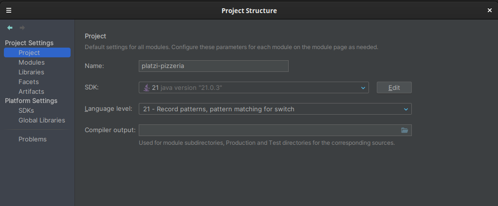
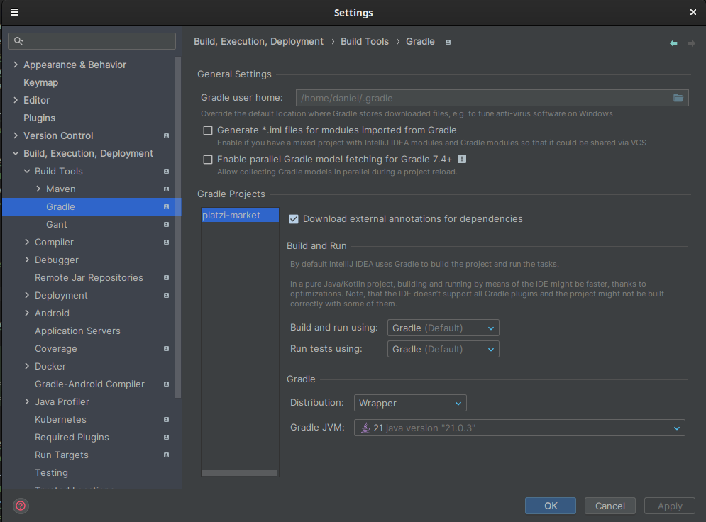

## Inicio de proyecto de Spring Boot
1. Ir a la página https://start.spring.io/ y crear el proyecto
2. Agregar las dependencias básicas necesarias para un proyecto básico
- Spring Web
- Spring Data JPA
- Lombok
- PostgreSQL Driver o MySQL Driver
- Spring Security (Opcional si se requiere un sistema de autenticación)
3. Descargar y descomprimir el proyecto generado y abrir desde Intellij Idea, seleccionando el archivo ``build.gradle``.
4. Configurar los datos del archivo ``application.properties``
- spring.profiles.active => El entorno del proyecto que utilizara para la ejecución de las propiedades
- server.port => El puerto por el que iniciara el proyecto
- server.servlet.context-path => El path base de conexion del proyecto
5. Configurar el archivo de entorno de desarrollo y producción
>El nombre debe poseer la siguiente estructura ``application-{nombre_del_entorno}.properties``, el valor que se coloca en nombre_del_entorno; ese valor va en la llave ``spring.profiles.active``
6. Configurar la base de datos
- Agregar la dependencia de la base de datos que se utilizara en el proyecto (postgres, mysql u otro), buscar la dependecia de la siguiente página https://mvnrepository.com/
  
- Agregar el siguiente texto a ``build.gradle`` para agregar mysql
>runtimeOnly 'com.mysql:mysql-connector-j'

- AgAgregar el siguiente texto a ``build.gradle`` para agregar postgresql
>runtimeOnly 'org.postgresql:postgresql'
7. Configurar el Proyecto en Intellij Idea
- Click en ``File`` -> ``Project Structure...`` -> Seleccionar ``Project`` -> en la opción de  ``SDK`` seleccionar la version de java que se opto utilizar en el proyecto.



- Click en ``File`` -> ``Settings...`` -> Seleccionar ``Build, Execution, Deployment`` -> ``Build Tools`` -> ``Gradle`` -> en la opción ``Gradle JVM`` seleccionar la versión de java que se opto por utilizar en el proyecto.



8. Configurar la base de datos en el archivo ``application.properties`` o el archivo del entorno en el que se trabaje si corresponde.
```properties
#Database
spring.datasource.url=jdbc:postgresql://localhost:5432/{nombre_base_datos}
spring.datasource.username=
spring.datasource.password=
```

9. Instalar mapstruct desde https://mapstruct.org/, dirigirse al apartado de ``Download`` y seguir las instrucciones.
10. Instalar el plugin ``MapStruct Support``
11. Instalar swagger para la documentación de la api
>implementation 'org.springdoc:springdoc-openapi-starter-webmvc-ui:2.1.0'
12. Agregar la siguiente propiedad a la configuración de ``application.properties``
>springdoc.swagger-ui.path=/swagger-ui.html
```properties
#Para poder ver el documento por ejemplo seria la ruta, tome en cuenta que dependera de la configuración que tiene en el context y el puerto de la api
http://localhost:9090/platzi-market/api/swagger-ui/index.html
```

13. Instalar seguridad posterior a crear el proyecto debe agregar los siguientes registros en ``build.gradle``
```properties
dependencies {
    implementation 'org.springframework.boot:spring-boot-starter-security'
    testImplementation 'org.springframework.security:spring-security-test'
}
```

13. Agregar oauth 0 al proyecto, dirigirse a la página https://jwt.io/, click en ``SEE JWT LIBRARIES``, posteriormente filtrar por ``Java``, en la opción ``maven: com.auth0 / java-jwt / 3.3.0``; ir al repositorio dando click en el icono de Github ``View Repo`` y finalmente dar click en la opción ``maven-central`` 
```properties
dependencies {
    implementation 'com.auth0:java-jwt:4.3.0'
}
```